# CPC464 Mechanical Keyboard (with SMT Diodes)

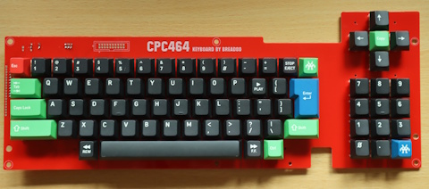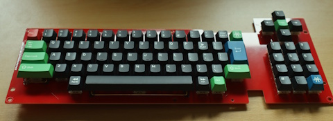

This project is for an replacement keyboard for an Amstrad CPC464 using Cherry MX compatible keyswitches.

The board is suitable for mounting within an existing CPC464 case and includes connections suitabe for both the single row 19/20-pin inline PCB type keyboard and the dual 10-pin connectors used by later membrane keyboards. It can also be used free standing, either with a CPC464 or CPC6128 - jumpers footprints are included to allow remapping of the dual 10-pin connectors. (The keyboard could also be used with a CPC664 but the lines will need remapping between the keyboard and motherboard. The schematic includes details). A third connector footprint is provided at the rear of the board with identical pinout to the 2x10-pin connector (and remapped via the same jumpers). This connector is intended to make the PCB easier to use as a free-standing board when, for example, using with a bare motherboard outside of a case.

Footprints allow either direct soldering of the keyswitches to the board, or the use of MX hotswap sockets. Hotswap sockets allow keyswitches to be more easily swapped for different types or between boards. The board accepts either 3-pin or 5-pin keyswitches but NOTE: There is currently no mounting plate available. We therefore recommend only using 5-pin keyswitches, and NOT 3-pin ones (5-pin switches have two extra mounting lugs on the rear).

The space bar has been reduced in width from the original 9u to a modern standard 7u. The space freed by this has allowed the addition of two 'bonus' keys. These can be mapped, via jumpers, to the main connectors for reading by the host computer, or can be connected to external hardware via the same jumpers.

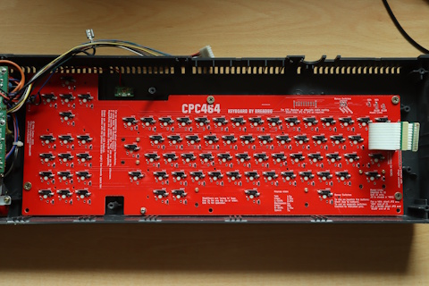

## Bill or Materials (BoM)

(This list does not include connectors. See the section below for some connection options).

|Reference|Value|Package|Qty|Notes|
|---------|-----|-------|---|-----|
|D0-D71,D79,D901,D902|1N4148W|SOD-123|75|If buying from a specialist mechanical keyboard retailer these will be the only surface mount diodes available. We recommend buying a few spares as these are very small and easy to lose.|
|SW0-SW71,SW79,SW901,SW902|MX Hotswap Sockets||75|Optional. Make sure you get the MX type.|
|SW0-SW71,SW79,SW901,SW902|MX Compatible keyswitches||75|Lots of options available. As noted above these should be 5-pin switches.|
|SW0-SW71,SW79,SW901,SW902|MX Compatible keycaps||75|Again of options available. See below for some advice.|
|ST1,ST2|Stabiliser 2u|PCB Mount|2|Use 'PCB Mount'/'screw in' type (NOT plate mount)	Stabilisers are usually supplied in sets which include all necessary parts including mounting screws. Each set will contain more than you need to this project, but make sure you get a set which includes a 7u wire for the space bar.|
|ST3|Stabiliser 7u|PCB Mount|1|(See notes for 2u stabilisers above).|

### Feet

If the board is used free-standing you will probably want to add some feet. The board includes 6(No) M3 mounting holes suitable for this. We would suggest rubber feet at the front and stand-offs at the rear (possibly with rubber feet on the end) to provide some 'raking' to the board.

## Assembly

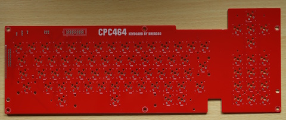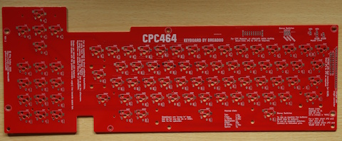
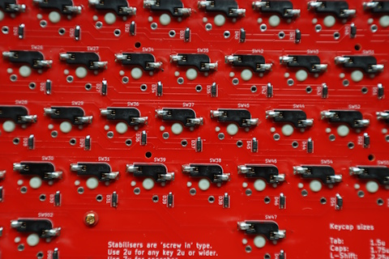

Begin by orienting yourself to the board and, in particular, which side is the top and which the bottom. The top of the board boards the square outlines of the keyswitches, the bottom has the footprints for the hotswap sockets and diodes. Diodes, hotswap sockets (if used) and keyswitches (if not using sockets) are all soldered to the bottom of the board.

We suggest the following assembly sequence.

1. Diodes

Diodes must be installed in the correct orientation. If examined closely you will notice a white line across one end of the diode. On the PCB this end all the diodes must point towords the front (space bar end) of the board. It might be wise to test a few with a multimeter to verify you are have this correct.

2. Hotswap sockets (if using them)

Orient each socket to match the silkscreen and so that the two lugs occupy the holes, then solder each pin.

It's worthwhile checking each socket is fully seated into the board by reheating each pin which pushing the socket with a finger - but take care not to burn your finger! We like to solder all the sockets, then go over one end of every socket. Then, once they have cooled, do the same for the other end of every socket.

3. Connectors and Jumpers (depending on your chosen options - see below)

For jumpers use some wire offcuts - perhaps resistor leads from a previous project?

4. Stabilisers

Check the manufacturers instructions. Pre-assembled ones are fairly straighforward, others are an IQ test which we often fail at on the first go. If the key doesn't press down properly you failed too.

5. Keyswitches (if not using sockets)

These are pretty straightforward. Insert each so that the pins are located in the plated (metalised) holes and fully pushed 'home'. Solder both pins. Double check they are fully seated and, if necessary, reheat while pushing down on the switch.

6. Keyswitches (if using sockets)

This one is easy! Insert the keyswitches, but make sure the pins are mounted into the sockets (this may sound dumb, but they are easily bent).

## Jumper Settings

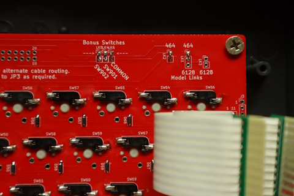

'Bridging' a solder link entails soldering some bare wire between two pins on the link.

If connecting to a '464 bridge LK2 and the two pins at the '464' end of LK1 (as shwon in the photo).

If connecting to a '6128 bridge LK3 and the two pins at the '6128' end of LK3.

(If using the board freestanding and want the flexibility to move it between computers you could also use pin-header with 'shunts' to bridge them. If so you may want to locate them on the top-side of the board).

## Bonus Switches

To map the bonus switches to joystick 1 fire buttons, short the connectors as shown in the photo.

To use as separate switches make connections to three holes indicated by the arrows.

## Installation

The keyboard is attached to the case with five or six screws (depending on the case revision) and replacement is straightforward. Take care not to overtighten the screws as the threads in the plastic case are easy to strip.

The spade terminal ground connection cannot be connected to the new PCB and will need to be covered with electrical insulation tape or similar to prevent it shorting anything.

## Connecting to the motherboard

Connection options depend on your motherboard revision. We are open to feedback and suggestions for better options.

### Single Row Motherboards (PCB style keyboards)

Amstrad appear to have used two different connector styles over the life of the machine. Sadly neither of these seem to be still available. The best option is probably replacing the motherboard header with something which is available, and directly soldering wires to the keyboard PCB (as per original Amstrad keyboards).

### Double Row Motherboards (membrane style keyboards)

PCBs are available which can slot into the motherboard connectors. We have our own available at https://github.com/Bread80/Keyboard-FPC10  The motherboard connectors are single sided and the PCBs will need to be assembled to match. Note that these PCBs must be manufactured to a suitable thickness for inserting into the sockets.

Our preference is to use FFC/FPC cables (with 2.54mm pin pitch) to connect these to the keyboard, the other end being direct soldered to the board.

## Keycaps

There is, obviously, a wide selection of keycaps available. In the board shown in the photos we've used the lovely Amstrad inspired set available at https://finalkeystudio.com/products/amstrad-cpc-464-keycaps-set which has both '464 and '6128 inspired options. Sadly the set  doesn't cover ever key you'll need (note the CLR and DEL keys in the photos) but there are plenty of other keys which can be used to substitute. The set also uses 'standard' layout for (eg) symbols rather than (any of) the Amstrad layout(s). (We have no connection to the designer or seller, and can't offer buying advice, but we do love the keycaps).

When selecting a set you'll need one which includes the following key widths:
|Key|Width|
|---|-----|
|Tab|1.5u|
|Caps|1.75u|
|Left Shift|2.25u|
|Backspace|1u|
|Enter|ISO standard|
|Right Shift|1.75u|
|Space bar|7u|

It's also worth noting that you're unlikely to find a set which matches the Amstrad symbol layout. If rearranging keys note that keycap profiles are different for every row and swapping keys between rows may not be ideal.

Rather than re-arranging the keys the Amstrad firmware has support for remapping the layout in software. This is (currently) left as an exercise for the reader.

## Schematic

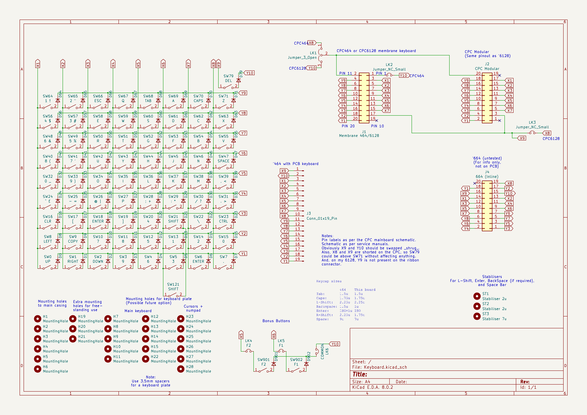

## Licence

CERN-OHL-P

You are welcome you sell items for cost plus reasonable postage fees. This allows you to pass on any overages from your PCB fab's minumum order levels. If you want to sell items for profit please talk to us first.

## More Images

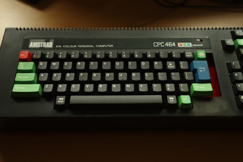
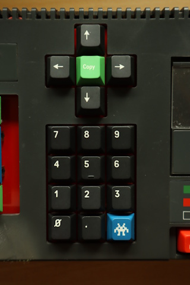
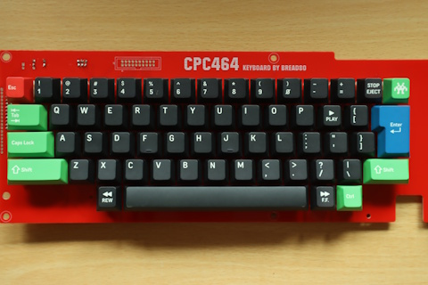
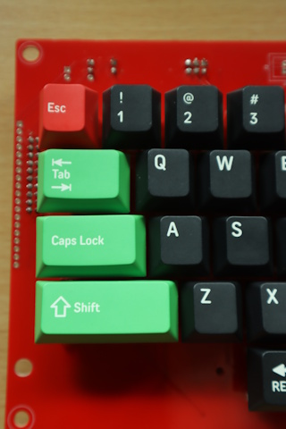
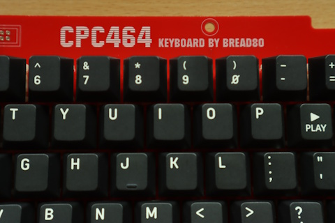
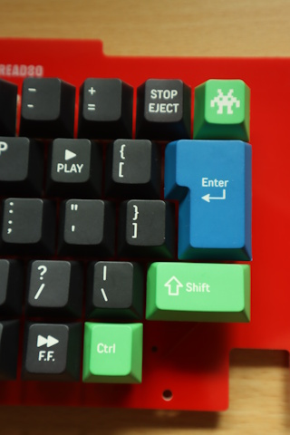
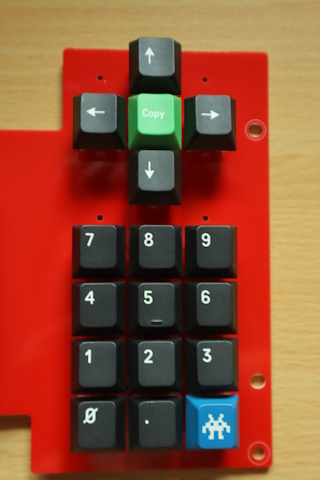
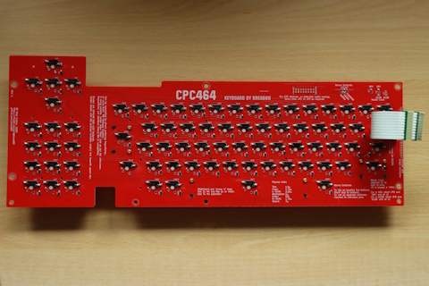
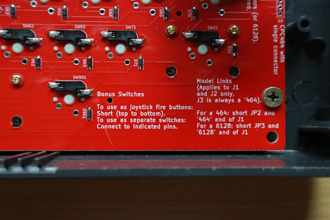